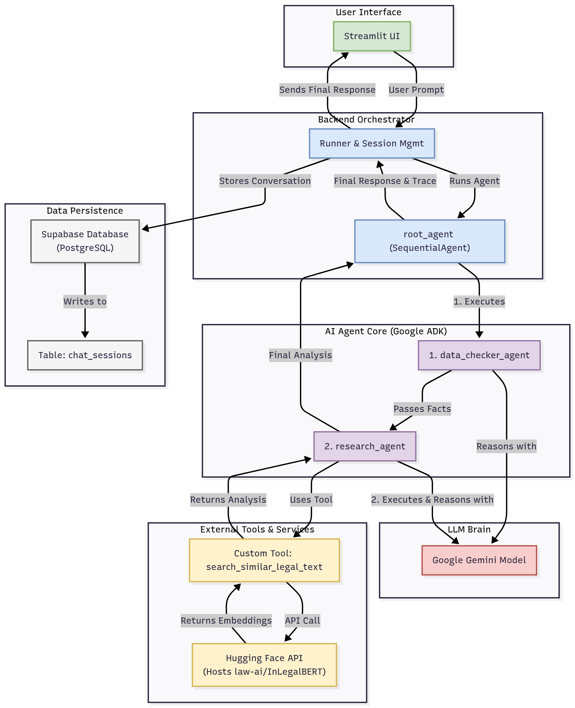

# ⚖️ Nyaya Sahayak: AI Legal Advocate

An AI-powered legal advocate that helps users understand their rights and provides legal information using **Google's Agent Development Kit (ADK)** and specialized tools.

***

## ✨ Features

* **Sequential Processing:** Uses a **Sequential Agent** pipeline to ensure a reliable workflow: Fact Validation → Specialized Research → Synthesis.
* **Data Validation & Elicitation:** The initial agent (`data_checker_agent`) is designed to **validate user input** and will pause the sequence to prompt the user for missing key facts (like dates, location, parties) before proceeding.
* **Specialized Legal Analysis (LL-BERT):** Performs deep semantic research using a custom tool integrated with a **Legal Language Model (InLegalBERT)**. This ensures the analysis is highly relevant and accurate to complex Indian legal documents and precedents, surpassing the capabilities of general-purpose LLMs.
* **Data Persistence & Auditing:** Logs the entire conversation history and the agent's full execution trace to a **Supabase** backend for reliable session recall and auditing.
* **Empathetic Output:** Provides professional, structured, and compassionate legal guidance.

***

## 🏗️ Project Architecture

The solution uses a **three-agent sequential pipeline** to ensure reliability and accuracy in legal research. The `SequentialAgent` orchestrates the data flow, ensuring that the output of one specialized agent becomes the input for the next.

| Agent Name | Role in the Pipeline | Key Tool |
| :--- | :--- | :--- |
| **`data_checker_agent`** | **Fact Validation & Extraction.** Engages the user to collect all necessary facts. If data is incomplete, it asks clarifying questions. It passes clean, complete facts downstream. | None |
| **`research_agent`** | **Deep Semantic Analysis.** Receives the structured facts and uses the specialized tool to perform semantic matching and extract the most relevant legal text. | `FunctionTool(InLegalBERT)` |
| **`advocate_synthesizer`** | **Synthesis & Final Advice Generation.** Combines the complete facts and the legal analysis to formulate the final, structured, and actionable legal advice for the user. | None (Synthesis Only) |





***

## ⚙️ Setup

1.  **Clone the repository:**
    ```bash
    git clone your-repo-name
    cd your-repo-name
    ```

2.  **Install dependencies:** Make sure you have the required packages installed:
    ```bash
    .\.venv\Scripts\activate
    pip install -r requirements.txt
    ```

3.  **Configure Secrets (CRITICAL):** Create a file named `.env` in your project root for secure configuration of your API keys.

    ```
    GOOGLE_API_KEY=YOUR_NEWLY_GENERATED_GEMINI_API_KEY"
    SUPABASE_URL=[https://slwakayleeoatjunvwoy.supabase.co](https://slwakayleeoatjunvwoy.supabase.co)
    SUPABASE_KEY=YOUR_SUPABASE_ANON_PUBLIC_KEY
    HF_TOKEN=YOUR_HUGGING_FACE_TOKEN_FOR_INLEGALBERT
    ```

    > **Note:** These keys are accessed securely via `os.getenv()` in the deployment environment. The application will not run without valid keys.

***

## ▶️ Running the Application

### Option 1: Command Line Interface (For Debugging)
```bash
streamlit run app.py